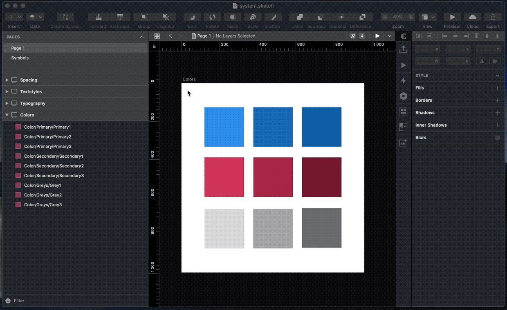
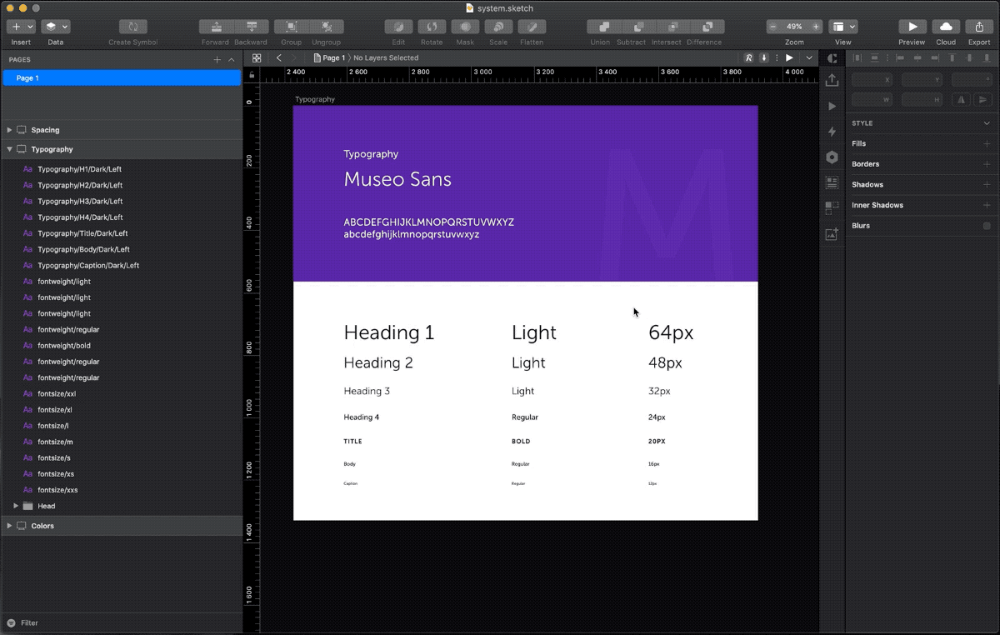
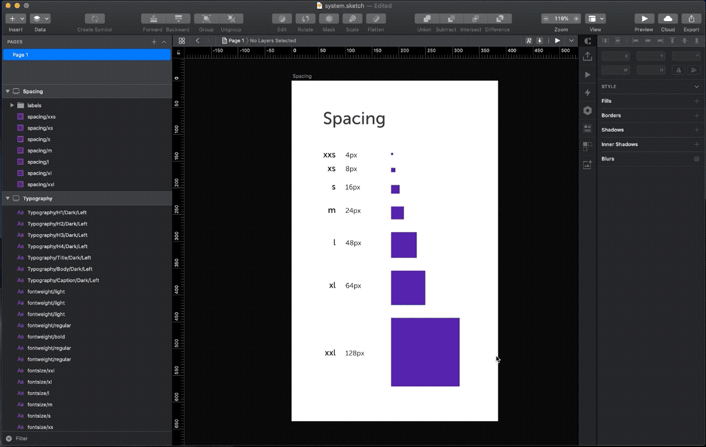
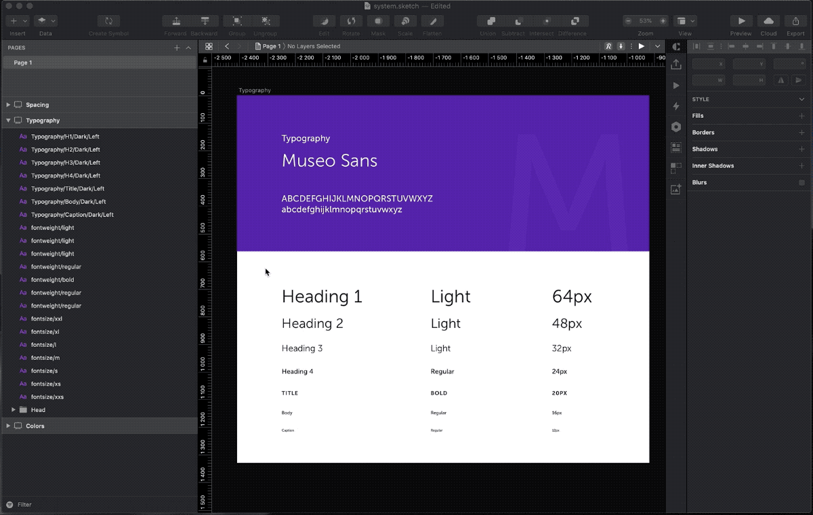

# Design Token Exporter

Export Design tokens from your Sketch project. You can export colors, text, spacing tokens and text style objects. 

- You can choose fileformat: SCSS, CSS, LESS, JSON, JavaScript (Object/Variables)
- You can choose colorformat: HEX or RGBA
- You can choose text tokens: font family, font size, font weight, line height or letter spacing 
- You can choose units: Absolute (px) or Relative (rem)
- You can choose naming (kebab-case, camelCase or part of layer name)

## Features 

1. Export color tokens
2. Export text tokens
3. Export spacing tokens
4. Export textstyles

### 1. Export color tokens

Select layers and go to `Plugins -> Design Token Exporter -> Export color tokens`



**Example output - colors.scss (SCSS, HEX)**

```scss
$primary1: #b39ddb;
$primary2: #673ab7;
$primary3: #512da8;
$primary4: #311b92;
$secondary1: #b2dfdb;
$secondary2: #4db6ac;
$secondary3: #009688;
$secondary4: #00796b;
$grey1: #cfd8dc;
$grey2: #90a4ae;
$grey3: #607d8b;
$grey4: #37474f;
```

### 2. Export text tokens

Select layers and go to `Plugins -> Design Token Exporter -> Export text tokens`



**Example output - fontsize.json (JSON, Font size, Absolute(px))**

```json
{
	"fontSize": {
		"xxl": "64px",
		"xl": "48px",
		"l": "32px",
		"m": "24px",
		"s": "20px",
		"xs": "16px",
		"xxs": "12px"
	}
}
```

### 3. Export spacing tokens

Select layers and go to `Plugins -> Design Token Exporter -> Export spacing tokens`



**Example output - spacing.css (CSS, Relative(rem))**

```css
:root {
   --spacing-xxs: 0.25rem;
   --spacing-xs: 0.5rem;
   --spacing-s: 1rem;
   --spacing-m: 1.5rem;
   --spacing-l: 3rem;
   --spacing-xl: 4rem;
   --spacing-xxl: 8rem;
}
```

### 4. Export textstyles

Select layers and go to `Plugins -> Design Token Exporter -> Export textstyles`



**Example output - textstyles.js (JavaScript Object, Absolute(px))**

```js
const textStyles = {
	h1: {
		fontFamily: "Museo Sans",
		fontSize: "64px",
		fontWeight: 300,
		lineHeight: "64px",
		letterSpacing: "normal",
		textTransform: "none",
	},
	h2: {
		fontFamily: "Museo Sans",
		fontSize: "48px",
		fontWeight: 300,
		lineHeight: "48px",
		letterSpacing: "normal",
		textTransform: "none",
	},
	h3: {
		fontFamily: "Museo Sans",
		fontSize: "32px",
		fontWeight: 300,
		lineHeight: "48px",
		letterSpacing: "normal",
		textTransform: "none",
	},
	h4: {
		fontFamily: "Museo Sans",
		fontSize: "24px",
		fontWeight: 500,
		lineHeight: "36px",
		letterSpacing: "normal",
		textTransform: "none",
	},
	title: {
		fontFamily: "Museo Sans",
		fontSize: "20px",
		fontWeight: 700,
		lineHeight: "36px",
		letterSpacing: "1.5px",
		textTransform: "uppercase",
	},
	body: {
		fontFamily: "Museo Sans",
		fontSize: "16px",
		fontWeight: 500,
		lineHeight: "24px",
		letterSpacing: "normal",
		textTransform: "none",
	},
	caption: {
		fontFamily: "Museo Sans",
		fontSize: "12px",
		fontWeight: 500,
		lineHeight: "18px",
		letterSpacing: "normal",
		textTransform: "none",
	},
}
```

## How to install 

**Sketch Runner**

- Trigger Sketch Runner
- Go to the 'Install' tab
- Search 'Design Token Exporter' and install

**Manual**

- Download the Zip-folder. Extract zip and double-click the `design-token-exporter.sketchplugin`

## Contact/Feedback

Mail [herkko@erhe.fi](mailto:herkko@erhe.fi)
Twitter [@here_erhe](https://twitter.com/here_erhe)

## License

This project is licensed under the terms of the MIT license.