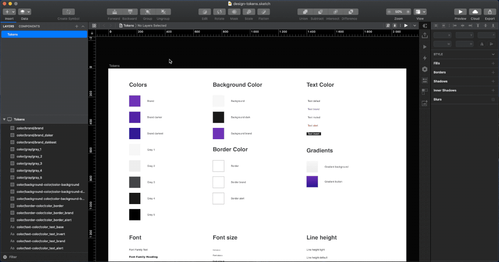

# Design Token Exporter

**Export Design Tokens from your Sketch project.**

- You can export Design Token file either JSON or YAML format. Token file follow Salesforce [Theo](https://github.com/salesforce-ux/theo) spec.
- Layers naming format is type/category/tokenname (e.g. color/background-color/color-background)

**Available categories:**

| Category                     | Sketch Layer type              | Value														|
| ---------------------------  | ------------------------------ | --------------------------------------------------------- |
| `spacing`/`space`/`spacer`   | Shape Layer            		| Layer height 												|
| `sizing`/`size`              | Shape Layer            		| Layer height 												|
| `font`                       | Text Layer             		| Font weight (type=number) /  Font Family (type=...)		|
| `font-style`                 | Text Layer            		 	| Font style												|
| `font-weight`                | Text Layer           			| Font weight 												|
| `font-size`                  | Text Layer             		| Font Size 												|
| `line-height`                | Text Layer           	 		| Line height 												|
| `font-family`                | Text Layer          	 		| Font Family 												|
| `border-style`               | Shape Layer           		 	| Border style 												|
| `border-color`               | Shape Layer           		 	| Border style or Fill color 								|
| `radius`                     | Shape Layer                  	| Radius  													|
| `border-radius`              | Shape Layer            		| Radius 													|
| `hr-color`                   | Shape Layer  					| Fill color 												|
| `background-color`           | Shape Layer       			 	| Fill color 												|
| `gradient`                   | Shape Layer              		| Fill gradient 											|
| `background-gradient`        | Shape Layer    				| Fill gradient 											|
| `drop-shadow`                | Shape Layer            		| Shadows 													|
| `box-shadow`                 | Shape Layer             		| Shadows 												 	|
| `inner-shadow`               | Shape Layer      				| Inner Shadows 											|
| `text-color`                 | Shape Layer or Text Layer      | Text color or Fill color 									|
| `text-shadow`                | Shape Layer or Text Layer      | Layer shadow 												|
| `time`                       | Text Layer                   	| Text layer value 											|
| `media-query`                | Text Layer          			| Text layer value 											|
| `z-index`                	   | Text Layer          			| Text layer value 											|
| `any`                	   	   | Shape Layer          			| Fill color  (type=color)									|


**Export variables from your Sketch project. You can export colors, text, spacing variables and text styles.**

- You can choose file format: SCSS, CSS, LESS, JSON, JavaScript (Object/Variables)
- You can choose color format: HEX or RGBA
- You can choose text value: font family, font size, font weight, line height or letter spacing 
- You can choose units: Absolute (px) or Relative (rem)
- You can choose naming (kebab-case, camelCase or part of layer name)

## Features 

1. Export Tokens
2. Export Color Variables
3. Export Text Variables
4. Export Spacing Variables
5. Export Text Styles

### 1. Export Tokens

Select layers or one artboard and go to `Plugins -> Design Token Exporter -> Export Tokens`



**Example output - tokens.yml**

```yml
props:
  gray_1:
    value: "#fafaf9"
    type: "color"
    category: "gray"
  gradient_background:
    value: "linear-gradient(180deg, #FAFAF9 0%, #F3F2F2 100%)"
    type: "..."
    category: "gradient"
  spacing_m:
    value: "16px"
    type: "number"
    category: "spacing"
  font_size_l:
    value: "24px"
    type: "number"
    category: "font-size"
```

### 2. Export Color Variables

Select layers and go to `Plugins -> Design Token Exporter -> Export Color Variables`


**Example output - colors.scss (SCSS, HEX)**

```scss
$primary1: #b39ddb;
$primary2: #673ab7;
$primary3: #512da8;
$primary4: #311b92;
$secondary1: #b2dfdb;
$secondary2: #4db6ac;
$secondary3: #009688;
$secondary4: #00796b;
$grey1: #cfd8dc;
$grey2: #90a4ae;
$grey3: #607d8b;
$grey4: #37474f;
```

### 3. Export Text Variables

Select layers and go to `Plugins -> Design Token Exporter -> Export Text Variables`


**Example output - fontsize.json (JSON, Font size, Absolute(px))**

```json
{
	"fontSize": {
		"xxl": "64px",
		"xl": "48px",
		"l": "32px",
		"m": "24px",
		"s": "20px",
		"xs": "16px",
		"xxs": "12px"
	}
}
```

### 4. Export Spacing Variables

Select layers and go to `Plugins -> Design Token Exporter -> Export Spacing Variables`


**Example output - spacing.css (CSS, Relative(rem))**

```css
:root {
   --spacing-xxs: 0.25rem;
   --spacing-xs: 0.5rem;
   --spacing-s: 1rem;
   --spacing-m: 1.5rem;
   --spacing-l: 3rem;
   --spacing-xl: 4rem;
   --spacing-xxl: 8rem;
}
```

### 5. Export Text Styles

Select layers and go to `Plugins -> Design Token Exporter -> Export Text Styles`


**Example output - textstyles.js (JavaScript Object, Absolute(px))**

```js
const textStyles = {
	h1: {
		fontFamily: "Museo Sans",
		fontSize: "64px",
		fontWeight: 300,
		lineHeight: "64px",
		letterSpacing: "normal",
		textTransform: "none",
	},
	h2: {
		fontFamily: "Museo Sans",
		fontSize: "48px",
		fontWeight: 300,
		lineHeight: "48px",
		letterSpacing: "normal",
		textTransform: "none",
	},
	h3: {
		fontFamily: "Museo Sans",
		fontSize: "32px",
		fontWeight: 300,
		lineHeight: "48px",
		letterSpacing: "normal",
		textTransform: "none",
	},
	h4: {
		fontFamily: "Museo Sans",
		fontSize: "24px",
		fontWeight: 500,
		lineHeight: "36px",
		letterSpacing: "normal",
		textTransform: "none",
	},
	title: {
		fontFamily: "Museo Sans",
		fontSize: "20px",
		fontWeight: 700,
		lineHeight: "36px",
		letterSpacing: "1.5px",
		textTransform: "uppercase",
	},
	body: {
		fontFamily: "Museo Sans",
		fontSize: "16px",
		fontWeight: 500,
		lineHeight: "24px",
		letterSpacing: "normal",
		textTransform: "none",
	},
	caption: {
		fontFamily: "Museo Sans",
		fontSize: "12px",
		fontWeight: 500,
		lineHeight: "18px",
		letterSpacing: "normal",
		textTransform: "none",
	},
}
```

## How to install 

- Download the [Zip-folder](https://github.com/here-erhe/Design-Token-Exporter/releases/latest). Extract zip and double-click the `design-token-exporter.sketchplugin`

## Contact/Feedback

Mail [herkko@erhe.fi](mailto:herkko@erhe.fi)

Twitter [@here_erhe](https://twitter.com/here_erhe)

## License

This project is licensed under the terms of the MIT license.